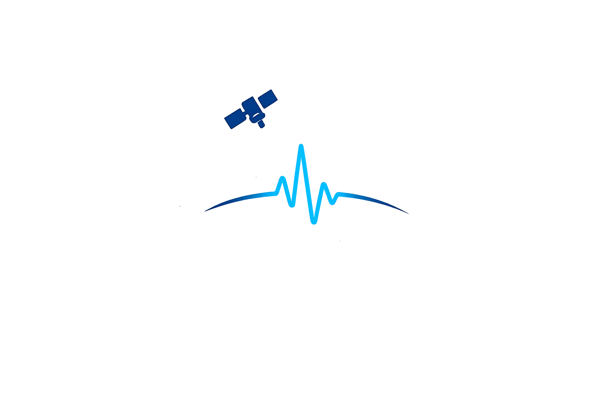

# Micro-motion-SAR

<p align="center">
  
</p>

**Measuring vibration of the ground and of structures from a single satellite pass.**

One radar pass is cut into sub-apertures — snapshots of the same ground at different
instants — and what moves between them is tracked and turned into a per-window vibration
spectrum. No second pass, no interferometric stack, no repeat cycle.

## AI full disclosure

This software is developed with strong assistance from Claude Opus 5, GPT-5.5 and GPT-5.6,
with humans leading the ideas, the testing and the debugging. We say this openly because it
shaped how the project was built. If you are not happy with AI-developed code, this software
is not for you.

## Why single-pass

Repeat-pass interferometry measures millimetres per year over days to years. This measures
millimetres per second within a single dwell, in the band where structures actually resonate.
They are different instruments for different questions, and almost no open software does the
second one.

The targets are stable man-made structures — bridges, dams, towers — under long-dwell
spotlight coverage, whose dominant modes project usefully onto the satellite line of sight.
That last condition is a real constraint and no software can check it for you.

## Status: baseline only

The chain is being built a stage at a time, each verified before the next is trusted. What
exists and passes its tests:

- readers for CPHD (32-bit float and 16-bit integer samples), SICD and UAVSAR
- time-domain backprojection
- sub-aperture decomposition, coregistration, phase linking
- `validate` — thirteen arithmetic checks on whether a collect can support the measurement
  you intend, before any of it is processed, answered for the `--estimator` you will
  actually run with: four of them mean different things for a correlation observable and
  a phase one
- null-test machinery, `rs_track_fit()`, a cross-window consensus statistic, an
  ampcor-style cull on what the correlation surfaces themselves say, and a
  per-window evidence file written beside every result
- an in-data positive control, `mmotion --inject-vib` — a scatterer of known frequency
  and amplitude added to the real phase history *before* sub-aperture formation, so the
  whole chain runs over it. A null on a real collect cannot on its own be told apart from
  a chain that cannot see motion in that data; this is what tells them apart
- a cross-check of the CPHD reader against SARPy (`tools/sarpy_crosscheck.py`),
  which is the only thing here that tests the parse of a real vendor product

21 tests pass. **The phase estimator recovers injected frequencies on synthetic fixtures**
— slope 1.008 and rms 0.0070 Hz against a half-bin bound of 0.0252, swept and pooled over
three clutter seeds, each with a static control that lands outside the swept band. That is
the first thing here to meet the bar below.

**It is also now bounded, by measurement rather than by caveat.** `docs/FOLLOW-UPS.md`
item 14 noted that the simulator gives every scatterer analytically exact phase, so the
sub-look decorrelation that most threatens a phase observable is absent by construction.
Item 24 added that mechanism — facets bright over only part of the aperture — and item 25
ran item 14's own sweep against it. The recovery does not survive: slope goes negative at
three of four settings, rms rises to 0.59–1.78 Hz against the 0.0252 bound, and two of
twelve *motionless* controls come back with a confident in-band frequency. So the estimator
does what it claims on the scene it was measured on, and there is no basis for expecting
that to transfer to a real collect. Selecting on amplitude dispersion is the only policy
that survives the change: it refuses where it cannot tell, and where it answers it returns
item 14's figures to four decimals.

On the real Giza collect the same estimator at 90% overlap returns a **null**, refused at
16% window agreement, with no trace of the fixed-frequency artefact the old
implementation produced at 100% agreement — the first evidence outside simulation that
the fix holds. Nothing in that scene is known to move, so the null bounds nothing.

Whether that null says anything about Giza at all is a separate question, and it is now
testable rather than arguable. Item 19 showed the phase route's precondition was unmet
across the whole scene — 0 of 225 windows met the amplitude-dispersion criterion — so the
run could not have succeeded whatever the pyramid was doing. `--inject-vib` puts a known
vibration into that same collect and asks whether the chain returns it.

**Nothing here has been shown to detect real motion, and the correlation estimator has
not been shown to recover a frequency anywhere.** No collect available to this project
contains motion known to be there, so no output should be read as a demonstrated
sensitivity.

## The bar

A result counts when it recovers an injected frequency with **slope near 1 and rms under
half a bin**, pooled over independent clutter realisations, on real clutter, with a static
control through identical processing.

Not a single frequency matched once. A chain that emits one fixed spurious frequency passes
a per-point test wherever that value happens to fall near the injection, which is why the
criterion is a fit across a sweep rather than a comparison at a point.

## A wrong setting does not fail loudly

This is the difficulty that shapes everything here. Ask for a measurement a collect cannot
support and you do not get an error — you get a complete, well-formed spectrum with a
confident peak in it, produced by the processing rather than by the ground. A motionless
scene run through the same settings produces one too, sometimes a stronger one.

Hence `validate` before processing, a null control beside every result, and a consensus
statistic that can report disagreement instead of a number.

## Read this before starting

[`docs/FOLLOW-UPS.md`](docs/FOLLOW-UPS.md) is the map of dead ends. It records, with
measurements, that sub-look images can be correct while the tracker fails to read them; that
the reference scheme looks like the binding constraint and is not; that cross-window
agreement is blind to artefacts produced by the processing rather than the scene; that a
gate derived from window geometry refused correct measurements; and that `validate`, the
command whose job is to warn before an expensive run, answered every question for the
correlation estimator and so refused a phase configuration that was correct. Each cost hours
to establish and none is recoverable from the code.

[`docs/DATASETS.md`](docs/DATASETS.md) lists open phase-preserving SAR datasets suitable for
experiments, with direct catalogue links and notes on their limitations.

## Build

```sh
cmake -S . -B build -DCMAKE_BUILD_TYPE=Release
cmake --build build --parallel
ctest --test-dir build --output-on-failure
```

No external dependencies. C11 and CMake; the FFT is vendored. `ctest` passes on a fresh
clone with no data — every test builds its own fixture.

Two build facts that bite: OpenMP is optional and silently absent on macOS unless Homebrew's
keg-only `libomp` is found, so read the configure line rather than assuming; and
`-ffast-math` is deliberately absent, because it permits reassociation and flushes denormals,
which perturbs the sub-pixel correlation peaks and interferometric phase this project
measures.

## Running it

[`docs/USER_GUIDE.md`](docs/USER_GUIDE.md) covers the four subcommands, the flags that
decide whether a large collect fits in memory, and how to read what `mmotion` prints —
including its two refusal paths, which are the output you should expect most often.
